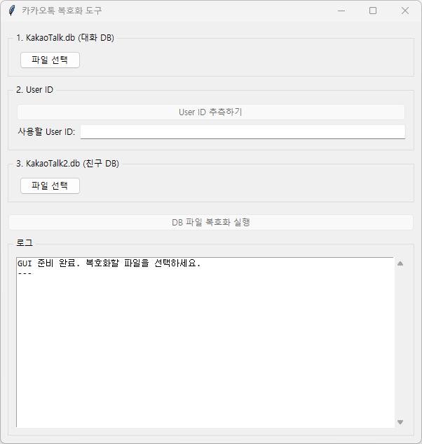
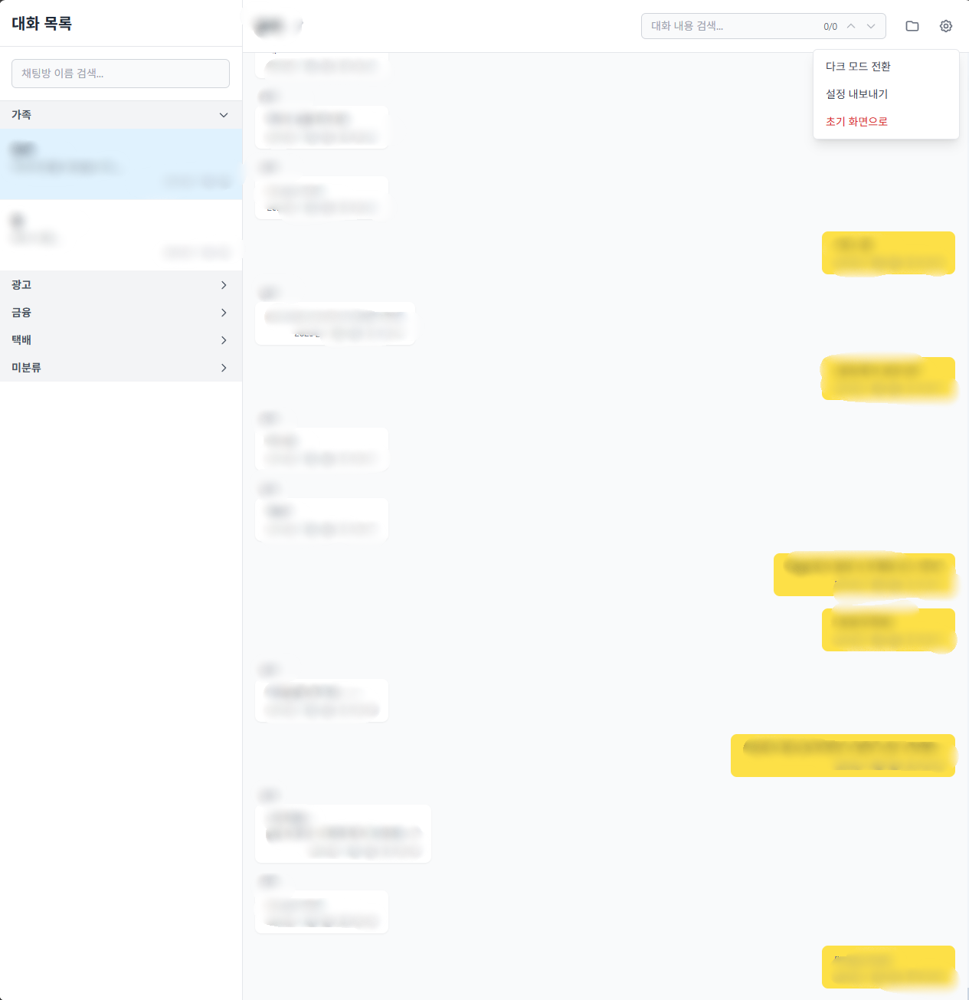
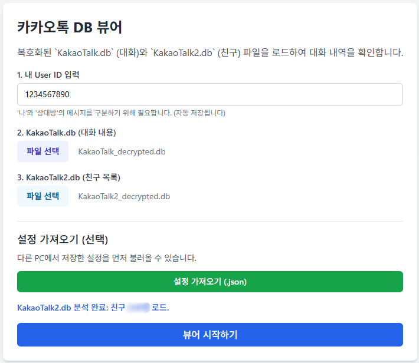

# 카카오톡 DB 복호화 GUI 및 웹 뷰어 (kakaodecrypt-gui-viewer)

원작자: [jiru/kakaodecrypt](https://github.com/jiru/kakaodecrypt)

이 프로젝트는 `jiru/kakaodecrypt`의 원본 코드를 기반으로, 사용 편의성을 위해 **GUI 복호화 도구**와 **HTML 웹 뷰어**를 추가한 포크(fork) 버전입니다. 원본을 제작해주신 jiru님께 감사드립니다.

---

## 🌟 핵심 기능 요약

- **GUI 복호화 도구 (`kakaodecrypt_gui.exe`)**
  - Windows용 단일 실행 파일(.exe)로 파이썬 설치 없이 복호화 가능.
  - `KakaoTalk.db` (대화)와 `KakaoTalk2.db` (친구) 파일을 선택하고 버튼만 누르면 자동 복호화.
  - `guess_user_id.py` 기능 통합: 가장 유력한 `user_id`를 자동 추측·입력.
  - 원본 DB는 `DB Backup` 폴더에 보관하고, 복호화된 파일은 `..._decrypted.db`로 별도 생성.

- **HTML 웹 뷰어 (`kakaotalk_viewer.html`)**
  - 브라우저에서 **오프라인으로** 복호화된 DB를 바로 불러와 카카오톡처럼 대화 확인.
  - 채팅방 관리(폴더화/이름 변경), 문장 검색(하이라이트, 결과 이동), 다크 모드 등 편의 기능 제공.
  - 모든 데이터는 로컬 브라우저에서만 처리되며 외부 전송 없음.

---

## 🖼 스크린샷

1. GUI 복호화 도구 (`kakaodecrypt_gui.exe`)



2. HTML 웹 뷰어 (`kakaotalk_viewer.html`)

- 라이트 모드 스크린샷
- 다크 모드 스크린샷
- 검색 / 폴더 / 이름 변경 등 주요 기능 스크린샷



---

## 🖥 HTML 웹 뷰어 상세 가이드 (`kakaotalk_viewer.html`)

`kakaotalk_viewer.html`은 단일 파일(SPA) 형태의 웹 애플리케이션으로, 브라우저 환경에서 직접 `.db` 파일을 읽어와 렌더링합니다. 모든 처리는 로컬에서 수행되어 네트워크 전송은 일체 발생하지 않습니다.

### 뷰어 전체 구조

- **레이아웃**: 2단(Left / Right)
  - 왼쪽: **사이드바(채팅방 목록)** — 채팅방 검색, 폴더별 그룹화, 채팅방 선택
  - 오른쪽: **메인 뷰(대화 창)** — 선택한 채팅방의 메시지 표시, 검색 입력, 채팅방 설정

- **데이터 흐름**:
  1. 브라우저에서 `KakaoTalk_decrypted.db` 와 `KakaoTalk2_decrypted.db` 파일을 입력받음
  2. IndexedDB / 메모리 기반으로 DB를 파싱하여 메시지 및 참가자 정보를 로드
  3. UI에 채팅방 목록 및 메시지를 렌더링

### 주요 컴포넌트

- **사이드바**
  - 채팅방 리스트 (자동 생성 이름 / 사용자가 지정한 이름 표시)
  - 폴더(그룹)별 정렬 및 접기/펼치기
  - 채팅방 검색 입력 (실시간 필터)

- **헤더(메인 뷰 상단)**
  - 채팅방 이름(편집 가능)
  - 참가자 툴팁(마우스 오버로 전체 참가자 목록 표시)
  - 폴더 지정 버튼(📁), 편집(✏️), 설정(⚙️)

- **메시지 목록**
  - 날짜 섹션, 발신자(나 / 상대방), 텍스트/이미지/파일/링크 표시
  - 메시지 내 ID 클릭 시 이름 변경 대화모달 (친구 이름 매핑)

- **검색 바(메인)**
  - 현재 열린 채팅방의 메시지 내 검색
  - 검색어 하이라이트: 상대방 메시지(노란색), 나(보라색)
  - (현재/전체) 검색 개수 표기 및 ▲/▼ 이동 버튼

### 상세 기능 설명

#### 1) 검색 기능
- **채팅방 검색**: 사이드바 상단에 입력하면 채팅방 이름 기준 실시간 필터링.
- **대화 내용 검색**: 메인 뷰 검색창에서 열린 방의 메시지 텍스트만 검색.
  - 단어 하이라이트(두 색상), 검색 결과 간 이동, 검색어 카운트 제공.

#### 2) 이름 커스텀 (친구 / 채팅방)
- **친구 이름 변경 (ID 매핑)**
  - 메시지 중 `ID:123456...` 클릭 → 모달에서 이름 입력 → 뷰어 전체에 반영.
  - 변경사항은 설정 내보내기 시 JSON에 포함.

- **채팅방 이름 변경**
  - 헤더의 ✏️ 버튼으로 이름 편집 가능. 빈 문자열로 저장 시 자동 생성 이름으로 복원.

#### 3) 폴더 관리
- 채팅방을 원하는 폴더(예: 업무, 가족, 친구)로 분류 가능.
- 폴더 클릭으로 접기/펼치기 상태를 유지(브라우저에 저장).
- 폴더 지정은 개별 채팅방 헤더의 폴더 버튼을 통해 수행.

#### 4) 설정 및 편의 기능 (⚙️)
- 다크 모드 토글: 라이트/다크 모드 전환(선택 상태는 브라우저에 저장)
- 설정 내보내기: 현재 설정(사용자 ID, 이름 매핑, 채팅방 이름, 폴더 정보)을 `kakaoviewer_settings.json`로 다운로드
- 초기 화면으로: 뷰어 새로고침을 통해 DB 선택 화면으로 복귀

#### 5) 기타 유용 기능
- **참가자 툴팁**: 단체 채팅 헤더에 마우스 오버 시 전체 참가자 표시
- **오픈채팅 감지**: 오픈채팅은 자동 라벨링([오픈])되어 목록/헤더에 배지 표시
- **로컬 저장**: 검색 히스토리, 사용자 설정, 폴더 상태 등은 브라우저 로컬에 저장됨

---

## 🗂 파일 구성 (권장 레포 구조)

```
/ (Root)
  ├─ kakaodecrypt_gui.py           # GUI 복호화 도구(파이썬 원본)
  ├─ kakaodecrypt_gui.exe          # Windows 용 빌드된 실행 파일 (Releases)
  ├─ kakaotalk_viewer.html         # 브라우저 기반 뷰어
  ├─ README.md                     # 프로젝트 설명 (이 파일)
  └─ /original
       ├─ kakaodecrypt.py          # 원본 커맨드라인 복호화 스크립트
       └─ guess_user_id.py        # 원본 User ID 추측 스크립트
```

---

## 📖 사용 방법 (간단 3단계)

### 1단계: (권장) MuMu 앱플레이어와 톡서랍으로 DB 파일 추출하기

이 방법은 휴대폰 **루팅 없이** PC 앱플레이어와 **카카오톡 ‘톡서랍’ 기능**을 활용해 안전하게 DB를 추출하는 방법입니다.

#### 준비물
- Windows PC
- **MuMu Player 12** (또는 루팅 가능한 다른 앱플레이어)
- **카카오톡 톡서랍 플러스 구독** (필수: 모든 대화를 복원하기 위함)

#### 추출 과정
1. **MuMu Player 설정 (태블릿 모드 + ROOT)**
   - MuMu Player 설치 및 실행
   - 메뉴(≡) → `설정` → `디바이스 탭` → 모델: **Galaxy Tab S6 Lite** 선택 → 저장
   - `기타 탭` → **ROOT 권한 활성화** → 재시작

2. **카카오톡 설치 및 톡서랍 동기화**
   - Play 스토어에서 카카오톡 설치 및 로그인 (태블릿 모드로 동시 로그인 가능)
   - 카카오톡 → 설정 → 채팅 → **톡서랍** → `데이터 복원하기` 클릭 → 전체 대화 복원

3. **DB 파일 추출 (Total Commander 사용)**
   - Play 스토어에서 `Total Commander` 설치
   - 실행 후 `/data/data/com.kakao.talk/databases/` 경로로 이동
   - `KakaoTalk.db`, `KakaoTalk2.db` 선택 → 공유 폴더(`/storage/emulated/0/Download`)로 복사
   - PC에서 복사된 DB 파일을 작업 폴더로 가져옴

### 2단계: DB 복호화 (옵션 A 또는 B)
복호화를 통해 암호화된 DB를 `..._decrypted.db` 파일로 생성합니다.

#### 옵션 A (권장) — GUI 실행 파일 사용
- Python 설치 불필요
- GitHub의 **Releases 탭**에서 `kakaodecrypt_gui.exe` 다운로드
- 1단계에서 추출한 `KakaoTalk.db`, `KakaoTalk2.db`를 `.exe`와 같은 폴더에 배치
- `kakaodecrypt_gui.exe` 실행 후 안내에 따라 다음 순서로 클릭:
  1. `[파일 선택]` → KakaoTalk.db 선택
  2. `[User ID 추측하기]` → 자동으로 입력됨
  3. `[파일 선택]` → KakaoTalk2.db 선택
  4. `[DB 파일 복호화 실행]`

복호화 완료 후 폴더 내에 `KakaoTalk_decrypted.db`, `KakaoTalk2_decrypted.db` 생성.

> ⚠️ **주의:** 이 파일은 PyInstaller로 빌드되어 일부 백신(V3, Windows Defender 등)에서 **False Positive(오탐)** 로 탐지될 수 있습니다. “추가 정보 → 실행”을 눌러 진행하세요.

#### 옵션 B — 개발자용 (Python 스크립트 실행)
1. Python 3 설치
2. `pip install pycryptodome` 실행
3. `kakaodecrypt_gui.py` 실행:
   ```bash
   python kakaodecrypt_gui.py
   ```
4. 이후 과정은 옵션 A의 5~6단계와 동일합니다.

---

### 3단계: 뷰어에서 대화 확인
1. `kakaotalk_viewer.html` 파일을 브라우저(Chrome 또는 Edge)로 엽니다.
2. **User ID 입력**: 2단계에서 찾은 `user_id` (예: 1234567890)
3. **DB 파일 선택**:
   - KakaoTalk.db → `KakaoTalk_decrypted.db`
   - KakaoTalk2.db → `KakaoTalk2_decrypted.db`
4. `[뷰어 시작하기]` 버튼 클릭 → 브라우저에서 대화 확인 가능.

   

---

## 🛠 개발자: .exe 직접 빌드하기

1. 저장소를 clone
2. PyInstaller 설치:

```bash
pip install pycryptodome
pip install pyinstaller
```

3. GUI 스크립트를 빌드:

```bash
pyinstaller --onefile --noconsole kakaodecrypt_gui.py
```

빌드 후 `dist/` 폴더에 `kakaodecrypt_gui.exe` 생성

---

## ⚠️ 원본 주의 사항 (Disclaimer — 원저자 문구 포함)

> I created this tool to decrypt my own chat logs because I’m too lazy
> to copy and paste them one by one from Kakaotalk. If you want to
> decrypt messages that were not intended to you, think about how
> you’d feel if someone would do that to you. You don’t want anybody
> to read your private conversations with your boyfriend, girlfriend,
> close friends, family… so don’t do it.
>
> It is your responsability to respect people’s privacy.

이 도구는 본인 소유의 데이터 또는 해당 행위에 대해 명확한 권한을 가진 경우에만 사용하시기 바랍니다. 타인의 프라이버시를 침해하는 용도로 사용하지 마십시오.

---

## 📝 라이선스

원본 저장소의 라이선스를 따릅니다. 원본에 라이선스가 명시되어 있지 않다면 개인적/비상업적 용도로의 사용을 권장합니다.

---

## FAQ & Troubleshooting

**Q1: 복호화 후 파일이 생성되지 않아요.**
- A: 올바른 `KakaoTalk.db` / `KakaoTalk2.db` 파일을 선택했는지, 권한(읽기 권한)이 있는지 확인하세요.

**Q2: .exe가 실행되지 않아요(또는 백신에서 차단됩니다).**
- A: 백신의 오탐일 가능성이 높습니다. 신뢰할 수 있는 릴리즈인지 확인 후 예외 등록하거나, 소스에서 직접 빌드하여 사용하세요.

**Q3: 뷰어에서 일부 메시지가 깨져 보입니다.**
- A: 데이터베이스 추출 과정에서 문제가 발생했을 수 있습니다. 다른 추출 방법을 시도하거나 원본 DB를 다시 확보하세요. DB 내부를 확인하고 싶다면 DB Browser for SQLite 프로그램을 설치하여 dec 리스트를 확인하세요.

---
